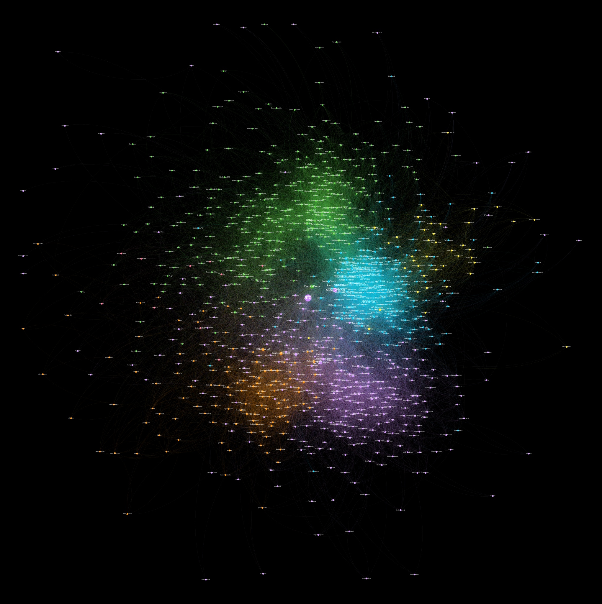

# Follower Network Twitter
## Goal
As part of a university project, I am going to build a graph of a user and its follower network on Twitter. The goal is to identify sub-communities and what they are talking about. The following users are going to be analysed:
- @AfD
- @Die_Gruenen

**Please note**: The data was collected over multiple weeks in May 2020 and is publicly accessible. The goal of this project is to objectivly understand different political groups on Twitter. My intention isn't to attack or expose people in any way.

## Approach

| Nr | Task | @AfD | @Die_Gruenen |
|----|------|------|--------------|
|1.    |Scrape the user's followers      |✅      |✅              |
|2.   |Scrape the followers of the user's followers      |✅      |✅              |
|3.    |Clean data and select important users    |✅      |✅            |
|4.    |Analyze connections between those users      |✅      |✅             |
|5.    |Generate graphs      |✅      |✅              |
|6.    |Apply cluster analysis     |✅      |✅              |
|7.    |Generate word clouds of those clusters      |🔴      |🔴              |

## Tools
- Use [bluebird](https://github.com/brunneis/bluebird) for scraping the data off of Twitter
- Use python for working with the data
- Use [Gephi](https://gephi.org) for graph generation and cluster analysis
- Use [wordcloud](https://github.com/amueller/word_cloud) for generating the word cloud

## Graph of @AfD
### Attempt to label clusters (based on small sample)
- Green: oberservers, media, ...
- Blue: German right-wing, AfD politician circle, ...
- Purple: US/ UK right-wing 
- Orange: EU right-wing

## Graph of @Die_Gruenen
### Attempt to label clusters (based on small sample)
- Green: federal level delegates, official party accounts (Linke, SPD, CDU, CSU, FDP, AfD), media, ...
- Blue: companies, economy magazines/ blogs, journalists, private media, YouTube influencers, ...
- Orange: celebrities, blogger, Twitter influencers, ...
- Pink: international greens (EU, UK, US), ...
- Dark Green: climate/ human rights/ charity organisations, FFF, unions, ...

