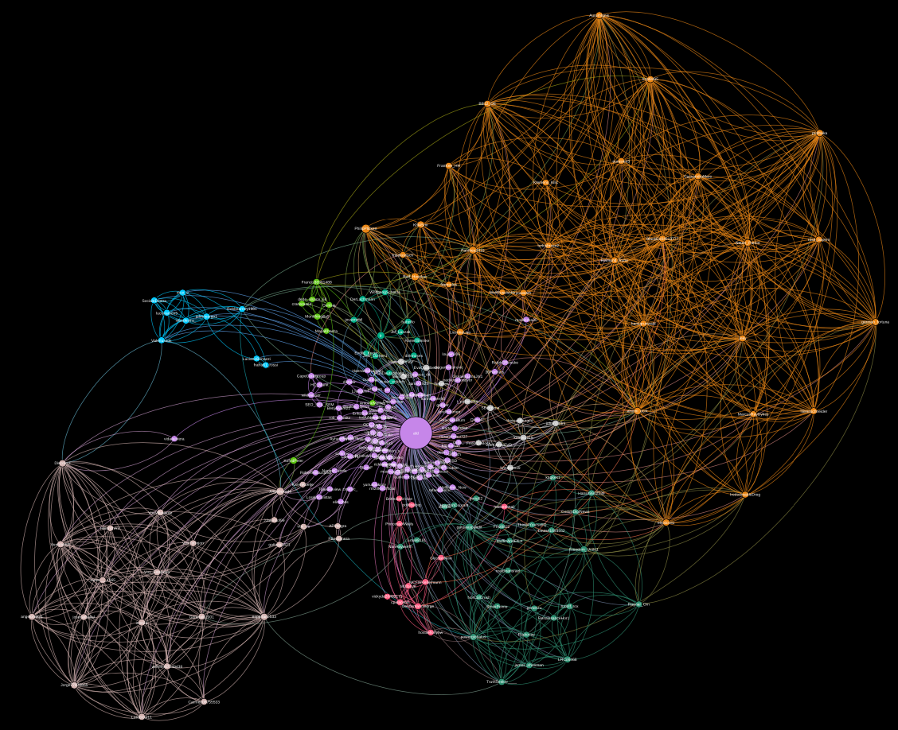

# Follower Network Twitter
## Goal
As part of a university project I am goint to build a graph of a user and its follower network on Twitter. The goal is to identify sub-communities and what they are talking about. The following users are goint to be analysed:
- @AfD
- @Die_Gruenen

## Approach
1. Scrape the users followers
2. Scrape the follwowers of those users
3. Clean data and select important users (>5000 followers)
4. Analyze connections between those users
5. Generate graphs
6. Apply cluster analysis
7. Generate word clouds of those clusters

## Tools
- Use [bluebird](https://github.com/brunneis/bluebird) for scraping the data off of Twitter
- Use python for working with the data
- Use [Gephi](https://gephi.org) for graph generation and cluster analysis
- Use [wordcloud](https://github.com/amueller/word_cloud) for generating the word cloud

## First graph of @AfD with 20% of data

